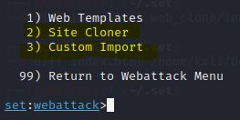
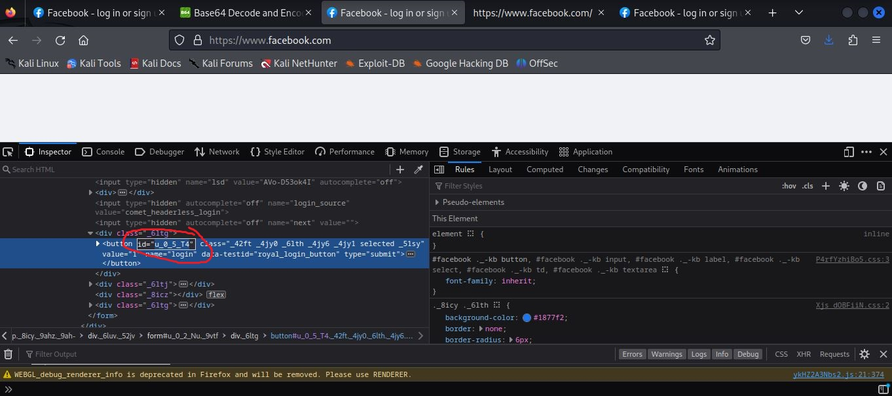
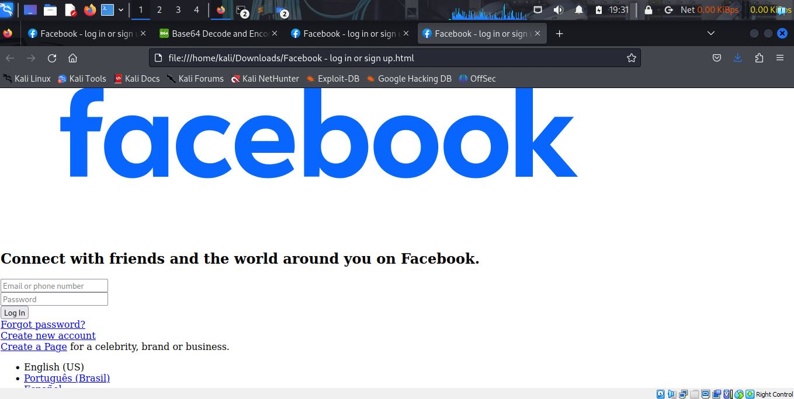
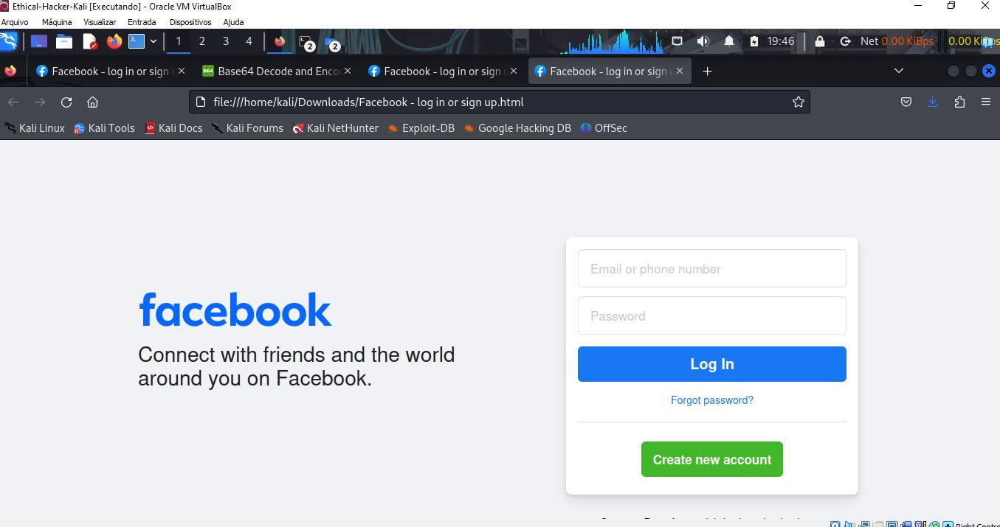
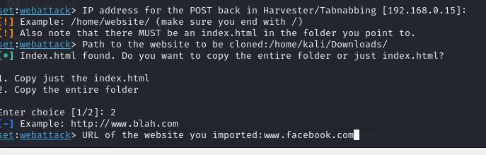

# Phishing para captura de senhas do Facebook

### Ferramentas

- Kali Linux
- setoolkit

### Configurando o Phishing no Kali Linux

- Acesso root: ``` sudo su ```
- Iniciando o setoolkit: ``` setoolkit ```
- Tipo de ataque: ``` Social-Engineering Attacks ```
- Vetor de ataque: ``` Web Site Attack Vectors ```
- Método de ataque: ```Credential Harvester Attack Method ```
- Método de ataque: ``` Site Cloner ```
- Obtendo o endereço da máquina: ``` ifconfig ```
- URL para clone: http://www.facebook.com

### Resutados para Versão do Facebook sem Defesa 


### Resultado Atual do Facebook com Defesa
-Observem que o site do facebook está usando um script que deve estar fazendo hashs e codifgicado em base64 os dados 
da página web , espcecialmente login e senha. Essa defesa é justamente contra script maliciosos pouco elaborados.


### Contornando a Defesa do Facebook
-Uma solução pode ser atualizando o script python do setoolkit. Contudo não é muito interessante ficar a cada site com suas defesas
peculiares ficar colocando a mão dentro do código do set.
-Outra solução é a oferecida pelo próprio setoolkit que é realizar uma importação customizada (Custon Import) no lugar da clonagem direta( Site Cloner). Na importação customizada iremos clonar um código fonte manipulado da página original. 



### Passo 1 
-Salve a página do facebook e também inspecione o botão log in e anote seu id.


-id do botão



-Aproveite para renomear logo a págna salva para index.html, pois o setookit usa esse nome por padrão.


### Passo 2 
-Na situação atual do código salvo, se abrirmos no navegador veremos a página do facebook muito feia, toda desconfigurada, pois os scripts e carregamentos de css não executam corretamente se carregados localmente. Aqui caberia horas e horas mudando o código fonte se realmente desejameos um trabalho bem elaboado. Um belo exercício de front-end.



-Obviamente vamos cortar caminho. Simplesmente vamos copiar o código fonte online do wwww.facebook.com no nosso arquivo index.html


-Podemos ver na imagem que a página já carrega como se fosse a página online. No print a seguir, ainda não se tinha renomeado a página local para index.html



-Ao procurarmos id do botão veremos onde ele está sendo manipulado no código fonte. Isso deu uma dica rápida de qual chamada de script deveria ser deletada.


### Passo 3 
-Vamos remover a linha do script


### Passo 4 
-Selecionamos agora no setoolkit Custom Import e em seguida devemos apontar a pasta do código fonte da página. 
- Copie o path  da pasta
 


-Cole o path no setoolkit


-Selecione copiar a pasta inteira (Copy entire folder)


-Defina como www.facebook.com



### Resultado após contorna a fefesa da página do facebook


